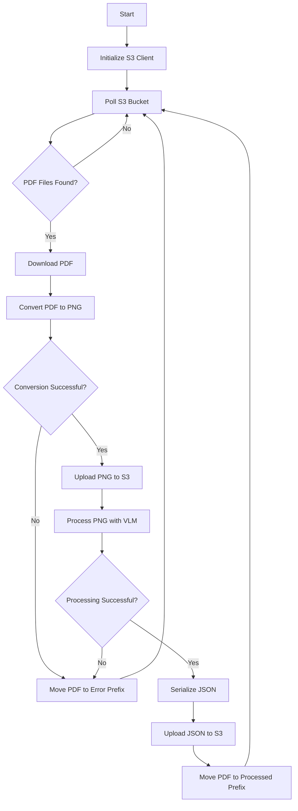

# Invoice Processor Upgrade Plan

## 1. Overview

We'll upgrade the invoice-vlm-processor.py script to:
- Monitor the "invoices/done" prefix in the S3 bucket for PDF files
- Convert PDFs to PNGs using the existing convert_pdf_to_png function
- Store PNGs in the "invoices/pngs" prefix
- Process the PNGs using the existing process_invoice function
- Serialize the resulting JSON to the "invoices/json-header" prefix
- Move successfully processed PDFs to "invoices/processed" prefix
- Move failed PDFs to "invoices/error" prefix
- Run continuously with the polling interval specified in POLL_INTERVAL

## 2. Architecture



## 3. Implementation Steps

### 3.1 Add Required Imports
- Import aioboto3 for S3 operations
- Import asyncio for asynchronous programming
- Import tempfile for temporary file handling
- Import json for JSON serialization

### 3.2 Modify Existing Functions
- Update convert_pdf_to_png to handle S3 paths
- Update process_invoice to return serialized JSON

### 3.3 Add New Functions
- create_s3_client(): Initialize the S3 client
- list_pdf_files(): List PDF files in the "invoices/done" prefix
- download_file(): Download a file from S3 to local storage
- upload_file(): Upload a file from local storage to S3
- move_s3_object(): Move an object from one S3 prefix to another
- process_pdf(): Orchestrate the PDF processing workflow
- main(): Main function to run the continuous polling loop

### 3.4 Error Handling
- Add comprehensive error handling for S3 operations
- Add error handling for PDF conversion
- Add error handling for VLM processing
- Move files to the error prefix when processing fails

## 4. Detailed Function Specifications

### 4.1 S3 Operations

#### create_s3_client()
```python
async def create_s3_client():
    """Create and return an aioboto3 S3 client using environment variables."""
    session = aioboto3.Session()
    return await session.client(
        's3',
        endpoint_url=ENDPOINT_URL,
        region_name=REGION,
        aws_access_key_id=ACCESS_KEY,
        aws_secret_access_key=SECRET_KEY
    )
```

#### list_pdf_files()
```python
async def list_pdf_files(s3_client):
    """List PDF files in the 'invoices/done' prefix."""
    try:
        response = await s3_client.list_objects_v2(
            Bucket=SOURCE_BUCKET,
            Prefix=PDF_INPUT
        )
        
        if 'Contents' not in response:
            return []
            
        return [obj['Key'] for obj in response['Contents'] 
                if obj['Key'].lower().endswith('.pdf')]
    except Exception as e:
        logger.error(f"Error listing PDF files: {e}")
        return []
```

#### download_file()
```python
async def download_file(s3_client, bucket, key, local_path):
    """Download a file from S3 to local storage."""
    try:
        await s3_client.download_file(bucket, key, local_path)
        logger.info(f"Downloaded {key} to {local_path}")
        return local_path
    except Exception as e:
        logger.error(f"Error downloading {key}: {e}")
        raise
```

#### upload_file()
```python
async def upload_file(s3_client, local_path, bucket, key):
    """Upload a file from local storage to S3."""
    try:
        await s3_client.upload_file(local_path, bucket, key)
        logger.info(f"Uploaded {local_path} to {bucket}/{key}")
        return key
    except Exception as e:
        logger.error(f"Error uploading {local_path} to {bucket}/{key}: {e}")
        raise
```

#### move_s3_object()
```python
async def move_s3_object(s3_client, bucket, source_key, dest_key):
    """Move an object from source_key to dest_key."""
    try:
        # Copy the object
        copy_source = {'Bucket': bucket, 'Key': source_key}
        await s3_client.copy_object(
            CopySource=copy_source,
            Bucket=bucket,
            Key=dest_key
        )
        logger.info(f"Copied {source_key} to {dest_key}")
        
        # Delete the original
        await s3_client.delete_object(Bucket=bucket, Key=source_key)
        logger.info(f"Deleted {source_key}")
        
        return dest_key
    except Exception as e:
        logger.error(f"Error moving {source_key} to {dest_key}: {e}")
        raise
```

### 4.2 Processing Functions

#### process_pdf()
```python
async def process_pdf(s3_client, bucket, key):
    """Process a PDF file from S3."""
    # Create a temporary directory for processing
    with tempfile.TemporaryDirectory() as temp_dir:
        try:
            # Download the PDF
            pdf_filename = os.path.basename(key)
            local_pdf_path = os.path.join(temp_dir, pdf_filename)
            await download_file(s3_client, bucket, key, local_pdf_path)
            
            # Convert PDF to PNG
            local_png_path = convert_pdf_to_png(local_pdf_path)
            if not local_png_path:
                raise Exception(f"Failed to convert {pdf_filename} to PNG")
            
            # Upload PNG to S3
            png_filename = os.path.basename(local_png_path)
            png_key = f"{PNG_OUTPUT}{png_filename}"
            await upload_file(s3_client, local_png_path, bucket, png_key)
            
            # Process the PNG with VLM
            invoice_object = process_invoice(local_png_path)
            if not invoice_object:
                raise Exception(f"Failed to process {png_filename}")
            
            # Serialize to JSON
            json_content = invoice_object.json()
            json_filename = os.path.splitext(png_filename)[0] + ".json"
            local_json_path = os.path.join(temp_dir, json_filename)
            
            with open(local_json_path, 'w') as f:
                f.write(json_content)
            
            # Upload JSON to S3
            json_key = f"{JSON_OUTPUT}{json_filename}"
            await upload_file(s3_client, local_json_path, bucket, json_key)
            
            # Move PDF to processed prefix
            processed_key = key.replace(PDF_INPUT, "processed/")
            await move_s3_object(s3_client, bucket, key, processed_key)
            
            logger.info(f"Successfully processed {pdf_filename}")
            return True
            
        except Exception as e:
            logger.error(f"Error processing {key}: {e}")
            
            # Move PDF to error prefix
            try:
                error_key = key.replace(PDF_INPUT, ERROR_PREFIX)
                await move_s3_object(s3_client, bucket, key, error_key)
            except Exception as move_error:
                logger.error(f"Error moving {key} to error prefix: {move_error}")
            
            return False
```

#### main()
```python
async def main():
    """Main function to run the continuous polling loop."""
    logger.info("Starting invoice processor")
    
    while True:
        try:
            # Create S3 client
            s3_client = await create_s3_client()
            
            # List PDF files
            pdf_files = await list_pdf_files(s3_client)
            
            if pdf_files:
                logger.info(f"Found {len(pdf_files)} PDF files to process")
                
                # Process one file at a time
                for pdf_key in pdf_files:
                    await process_pdf(s3_client, SOURCE_BUCKET, pdf_key)
            else:
                logger.info("No PDF files found to process")
            
            # Close the S3 client
            await s3_client.close()
            
        except Exception as e:
            logger.error(f"Error in main loop: {e}")
        
        # Wait for the next polling interval
        logger.info(f"Waiting {POLL_INTERVAL} seconds before next poll")
        await asyncio.sleep(POLL_INTERVAL)

if __name__ == "__main__":
    asyncio.run(main())
```

## 5. Testing Strategy

### 5.1 Unit Tests
- Test S3 operations with mocked responses
- Test PDF to PNG conversion with sample files
- Test VLM processing with sample images
- Test JSON serialization

### 5.2 Integration Tests
- Test end-to-end workflow with a sample PDF
- Test error handling with corrupted files
- Test continuous polling with multiple files

### 5.3 Manual Testing
- Upload a PDF to the "invoices/done" prefix
- Verify PNG is created in "invoices/pngs"
- Verify JSON is created in "invoices/json-header"
- Verify PDF is moved to "invoices/processed"
- Verify error handling by uploading a corrupted PDF

## 6. Deployment Considerations

### 6.1 Dependencies
- Ensure all required dependencies are installed:
  - aioboto3
  - pdf2image
  - llama-stack-client
  - python-dotenv

### 6.2 Environment Variables
- Ensure all required environment variables are set:
  - S3_ENDPOINT_URL
  - S3_DEFAULT_REGION
  - S3_ACCESS_KEY_ID
  - S3_SECRET_ACCESS_KEY
  - POLL_INTERVAL
  - LLAMA_STACK_SERVER
  - LLAMA_STACK_VISION_MODEL

### 6.3 Running as a Service
- Consider using systemd, Docker, or Kubernetes to run the script as a service
- Set up logging to a file or centralized logging system
- Set up monitoring and alerting for failures